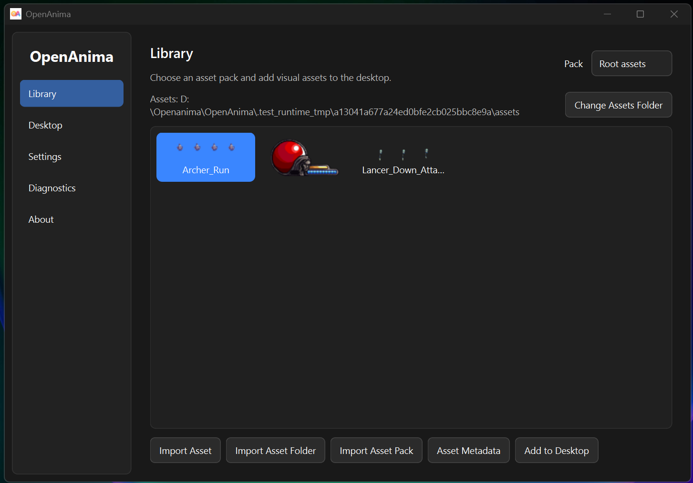
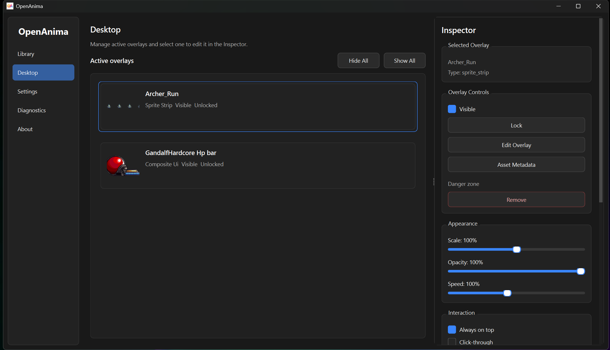
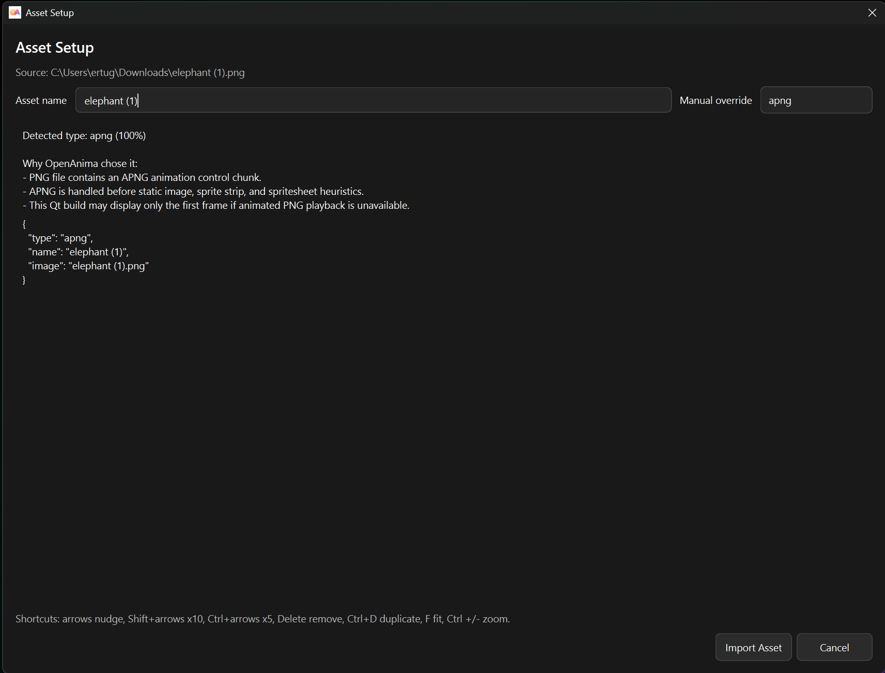
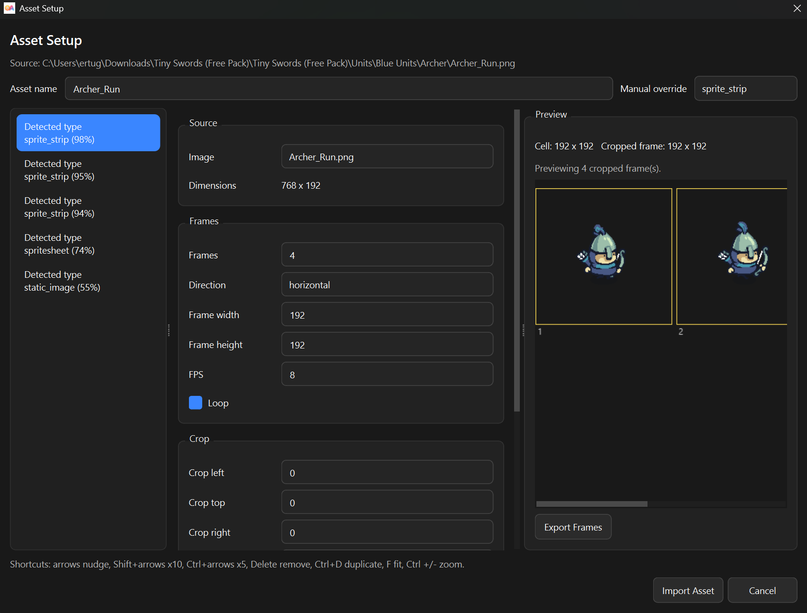
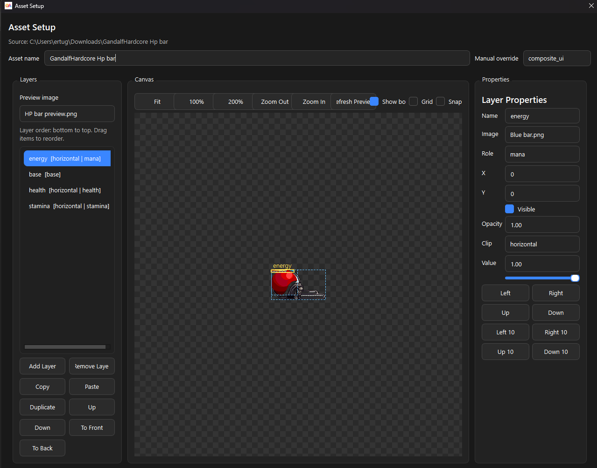
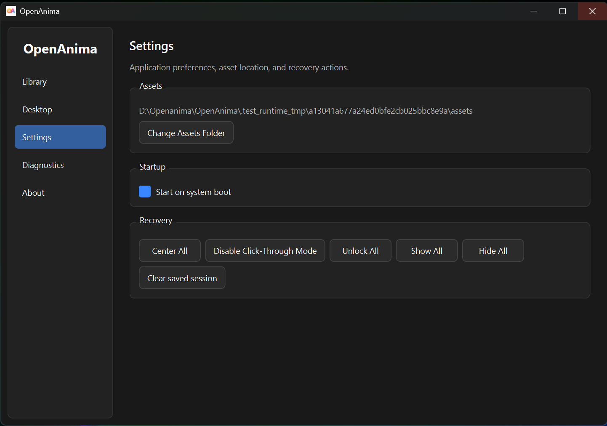
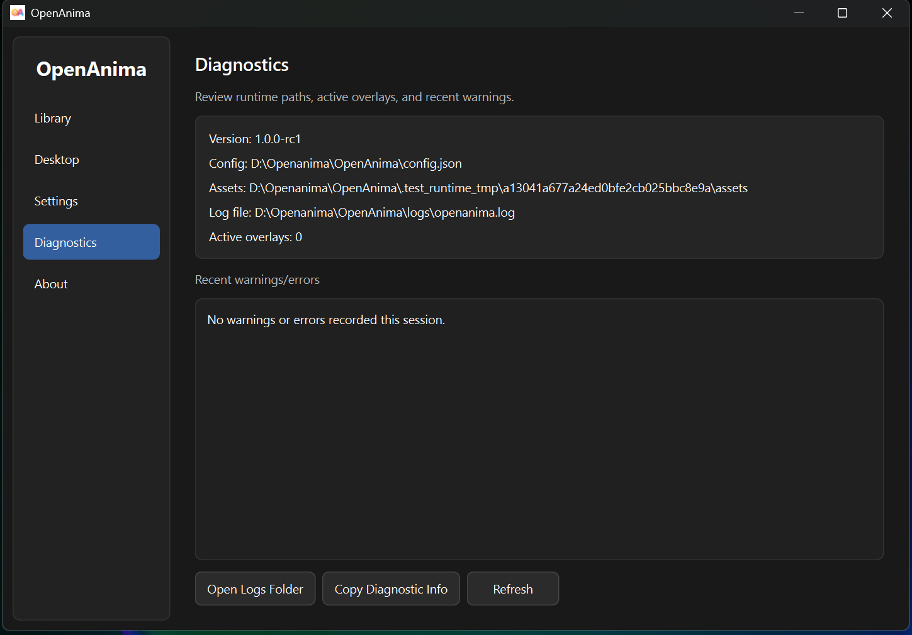

# OpenAnima

<p align="center">
  
</p>

<p align="center">
  <strong>Open-source desktop overlay engine for Windows.</strong>
</p>

<p align="center">
  Place local GIFs, APNGs, WebM videos, static images, sprites, frame animations, spritesheets, and HUD-style 2D assets directly on your desktop.
</p>

<p align="center">
  <a href="https://ertugrulmutlu.github.io/OpenAnima/"><strong>Website</strong></a>
|
<a href="https://apps.microsoft.com/detail/9n3hp2wxkxlg?hl=en-us&gl=DE&ocid=pdpshare"><strong>Microsoft Store</strong></a>
|
<a href="https://github.com/Ertugrulmutlu/OpenAnima/releases"><strong>Releases</strong></a>
|
<a href="https://ertugrulmutlu.itch.io/openanima"><strong>itch.io</strong></a>
|
<a href="https://youtu.be/qgJBF40b_L8"><strong>Demo Video</strong></a>
</p>

---

## Overview

OpenAnima is a lightweight Windows desktop app for running local 2D visual assets as independent overlay windows. It is built for desktop pets, animated GIF overlays, APNG animations, WebM video overlays, pixel-art characters, sticker-like images, sprite animations, small HUD widgets, and experimental desktop customization.

Each overlay can be moved, scaled, hidden, locked, made click-through, kept on top, and restored on the next launch. OpenAnima stores its runtime state locally and does not require an online service.

OpenAnima is not only a GIF player. It is a small desktop overlay engine with an asset library, metadata setup workflow, active overlay inspector, diagnostics, recovery tools, and support for multiple 2D asset formats.

The package version is defined in `openanima_app/version.py` and exposed as:

```python
import openanima_app

print(openanima_app.__version__)
```

---

## Demo

<p align="center">
  
</p>

<p align="center">
  <a href="https://youtu.be/qgJBF40b_L8"><strong>Watch the full demo on YouTube</strong></a>
</p>

---

## Screenshots

### Library

The Library page is used to select asset packs, import assets, review metadata, and add visual assets to the desktop.

<p align="center">
  
</p>

### Desktop And Inspector

The Desktop page shows active overlays. The Inspector lets you edit the selected overlay, including visibility, lock state, scale, opacity, speed, click-through, always-on-top behavior, actions, and movement settings.

<p align="center">
  
</p>

### Asset Setup

The Asset Setup dialog analyzes imported files and folders before they are added to the library. It can detect formats such as APNG, sprite strips, spritesheets, static images, and other supported asset types. Manual override is available when the automatic guess needs correction.

<p align="center">
  
</p>

### Sprite Strip Setup

Sprite strips can be configured with frame count, direction, frame size, FPS, loop behavior, crop settings, trim/padding options, anchors, live preview, and frame export.

<p align="center">
  
</p>

### Composite UI Builder

Composite UI assets are layered HUD-style assets. They can be used for health bars, mana bars, stamina bars, status widgets, and other game-like UI elements.

<p align="center">
  
</p>

### Settings

The Settings page contains asset folder configuration, startup behavior, and recovery actions for hidden, locked, click-through, or off-screen overlays.

<p align="center">
  
</p>

### Diagnostics

The Diagnostics page shows useful runtime information such as version, config path, asset root, log file path, active overlay count, and recent warnings or errors.

<p align="center">
  
</p>

---

## Features

* Multiple independent transparent desktop overlay windows.
* Drag, scale, opacity, and animation speed controls.
* Lock, click-through, always-on-top, show/hide, and remove controls.
* Local asset library with import workflows for files, folders, and asset packs.
* Asset pack selection from the Library page.
* Single asset import, asset folder import, folder-based asset pack import, and `.zip` asset pack import.
* Asset analyzer and setup dialog for configuring metadata-driven assets.
* Manual type override when automatic detection needs correction.
* Inspector controls for selected overlays.
* Optional per-overlay actions for opening files, folders, URLs, or applications.
* Ctrl + double click overlay action trigger.
* Optional movement settings with velocity, screen-edge bounce, gravity, and friction.
* Persistent sessions saved to `config.json`.
* UI state persistence for control panel visibility, window geometry, and last selected page.
* Overlay state persistence for visibility, actions, movement settings, selected animation, and composite UI runtime values.
* Safer config loading with schema versioning, atomic writes, and corrupt-config backup.
* Recovery tools for hidden, locked, click-through, or off-screen overlays.
* System tray recovery actions.
* File logging in `logs/openanima.log`.
* Diagnostics page for packaged builds.
* PyInstaller packaging support.

---

## Supported Asset Types

| Asset type         | Status                  | Notes                                                                                           |
| ------------------ | ----------------------- | ----------------------------------------------------------------------------------------------- |
| GIF                | Supported               | Animated with Qt movie playback.                                                                |
| Static images      | Supported               | `.png`, `.jpg`, `.jpeg`, and `.webp`. Transparent PNGs work well.                               |
| APNG               | Supported with fallback | APNG frames are decoded when available; unreadable animation falls back safely.                 |
| WebM               | Supported               | Playback uses Qt Multimedia. Codec and alpha behavior depend on the system backend.             |
| Frame folders      | Supported               | Ordered image frames with optional `asset.json` metadata.                                       |
| Sprite strips      | Supported               | Single-row or single-column sprite strips with frame settings, crop, preview, and export tools. |
| Spritesheets       | Supported with metadata | Named animations are configured in `asset.json`.                                                |
| Composite UI / HUD | Supported with metadata | Layered image assets with runtime value sliders.                                                |

Example frame-folder asset:

```txt
Idle/
  idle_01.png
  idle_02.png
  idle_03.png
  asset.json
```

Example `asset.json`:

```json
{
  "type": "frame_animation",
  "name": "Idle",
  "fps": 12
}
```

---

## Basic Workflow

1. Open the Control Panel.
2. Go to **Library**.
3. Choose an asset pack or stay in **Root assets**.
4. Click **Import Asset**, **Import Asset Folder**, or **Import Asset Pack**.
5. Review the detected type in the Asset Setup dialog.
6. Confirm the metadata or choose a manual type.
7. Select the imported asset and click **Add to Desktop**.
8. Go to **Desktop**.
9. Select the active overlay.
10. Use the Inspector to edit scale, opacity, speed, visibility, click-through, always-on-top, actions, and movement settings.

---

## Experimental Local API

OpenAnima includes an experimental Local API for same-machine automation. It is intended for streamer tools, VTuber setups, OBS helper scripts, scene switching, and desktop automation utilities that need to control local overlays.

Safety defaults: the Local API is disabled by default, binds only to `127.0.0.1`, and every modifying `POST` request requires `X-OpenAnima-Token`. External tools should prefer `persistent_id` for stable overlay targeting; `runtime_id` is session-only, and `api_alias` is an optional friendly name.

PowerShell setup:

```powershell
$base = "http://127.0.0.1:8765"
$token = "YOUR_TOKEN"
$headers = @{ "X-OpenAnima-Token" = $token }
```

Test status:

```powershell
Invoke-RestMethod -Uri "$base/api/status" -Method Get
```

List overlays:

```powershell
Invoke-RestMethod -Uri "$base/api/overlays/all" -Method Get
```

Spawn an overlay:

```powershell
$body = @{ asset_path = "C:/path/to/asset.gif"; x = 200; y = 200; scale = 1.0; opacity = 1.0 } | ConvertTo-Json
$overlay = Invoke-RestMethod -Uri "$base/api/overlays/spawn" -Method Post -Headers $headers -ContentType "application/json" -Body $body
$id = $overlay.id
```

Update an overlay:

```powershell
$body = @{ x = 300; y = 400; scale = 1.25; opacity = 0.8; visible = $true } | ConvertTo-Json
Invoke-RestMethod -Uri "$base/api/overlays/$id/update" -Method Post -Headers $headers -ContentType "application/json" -Body $body
```

Save a scene:

```powershell
$body = @{ name = "coding_scene" } | ConvertTo-Json
Invoke-RestMethod -Uri "$base/api/scenes/save" -Method Post -Headers $headers -ContentType "application/json" -Body $body
```

Inspect recent events:

```powershell
Invoke-RestMethod -Uri "$base/api/events/recent" -Method Get
```

Full Local API documentation and scripts are in [Local API examples and reference](examples/local_api/README.md).

If port `8765` is already in use, OpenAnima falls back to another local port. Use the URL shown on the **Local API** page.

Known limitations:

* The API is experimental and may change before a stable automation contract is declared.
* There is no WebSocket endpoint yet. Use `GET /api/events/recent` for the current in-memory event buffer.
* Some assets require the interactive Asset Setup workflow; `POST /api/assets/import` may return `501 interactive_setup_required`.

---

## What Can You Build With OpenAnima?

### Desktop Companions

Add animated pets, mascots, pixel characters, ghosts, cats, robots, or small visual toys that live directly on your desktop.

### Game-Style HUDs

Place health bars, mana bars, stamina bars, counters, status indicators, or ambient UI elements above your normal workspace.

### Creator Visuals

Use animated overlays while recording demos, tutorials, project videos, devlogs, or lightweight streams.

### Productivity Experiments

Prototype small animated widgets like focus timers, break reminders, ambient indicators, or visual notes.

---

## Install And Run

### Download

Download the Windows build from the GitHub Releases page:

```txt
https://github.com/Ertugrulmutlu/OpenAnima/releases
```

Run:

```bash
OpenAnima.exe
```

On first launch, OpenAnima creates local runtime files beside the executable or source checkout:

```txt
assets/
config.json
logs/
```

### Run From Source

Requirements:

* Windows
* Python 3.11 or newer recommended
* Dependencies from `requirements.txt`

```bash
pip install -r requirements.txt
python main.py
```

---

## Build EXE

OpenAnima uses PyInstaller and `OpenAnima.spec`.

```bash
pyinstaller OpenAnima.spec
```

Expected release output for a folder-style PyInstaller build:

```txt
dist/OpenAnima/OpenAnima.exe
```

The current spec is configured with `icon.ico`:

```python
icon=['icon.ico']
```

Depending on the PyInstaller mode produced by the spec, local builds may also emit a single executable at:

```txt
dist/OpenAnima.exe
```

Runtime files such as `config.json`, `assets/`, and `logs/` are created or used next to the running application.

---

## Project Structure

```txt
OpenAnima/
  main.py                    Application entry point
  OpenAnima.spec             PyInstaller build configuration
  requirements.txt           Python dependencies
  README.md                  Project documentation
  CHANGELOG.md               Release history
  LICENSE                    MIT license
  NOTICE.md                  Asset and rights notice
  docs/                      Website and release materials
  assets/                    Local sample/runtime asset folder
  tests/                     Automated tests
  openanima_app/
    app.py                   Application startup and tray wiring
    version.py               Package version
    assets/                  Asset models, metadata, detection, import, scan, thumbnails
    overlay/                 Overlay windows, flags, menus, movement, serialization
    rendering/               GIF/APNG/video/frame/sprite/composite rendering helpers
    runtime/                 Paths, logging, config, session, recovery, state, actions
    ui/
      asset_setup/           Asset setup dialog and preview helpers
      control_panel/         Library, Desktop, Editor, Settings, Diagnostics, About pages
```

---

## Configuration And Persistence

OpenAnima stores session state in:

```txt
config.json
```

Saved state includes:

* asset root
* active overlays
* asset paths and types
* position
* scale
* opacity
* speed
* lock state
* click-through state
* always-on-top state
* visibility
* selected spritesheet animation
* composite UI runtime values
* per-overlay actions
* movement settings
* selected page and control panel UI state

Config saves are atomic. If `config.json` is corrupted, OpenAnima backs it up as:

```txt
config.corrupt.YYYYMMDD_HHMMSS.json
```

The app then starts with safe defaults. Missing saved assets are skipped without preventing valid overlays from loading.

---

## Manual Smoke-Test Checklist

Before publishing a v1 release, run this checklist on a clean Windows machine or clean test folder:

* Launch `OpenAnima.exe`.
* Confirm the Control Panel opens without a terminal.
* Import a static PNG or JPG and add it to the desktop.
* Import a GIF and confirm it animates.
* Import an APNG and confirm it displays or falls back safely.
* Import a WebM and confirm playback starts when system codecs support it.
* Import a frame-folder animation.
* Import or configure a sprite strip.
* Import or configure a spritesheet with at least one named animation.
* Import or configure a composite UI asset and move a runtime value slider.
* Move, scale, change opacity, and change speed on an overlay.
* Toggle lock, click-through, always-on-top, visible, and hidden states.
* Configure and trigger an overlay action.
* Enable movement settings and test velocity, bounce, gravity, and friction.
* Restart the app and confirm valid overlays restore from `config.json`.
* Confirm missing saved assets are skipped without crashing.
* Use recovery actions: center all, show all, unlock all, disable click-through.
* Confirm `logs/openanima.log` is created and Diagnostics shows useful paths.
* Build with `pyinstaller OpenAnima.spec` and run the packaged executable.

---

## Known Limitations

* v1 is focused on 2D overlays for Windows.
* 3D model support is not included in v1.
* APNG playback depends on available decoding support and may fall back.
* WebM playback depends on Qt Multimedia, installed codecs, and backend behavior.
* Transparent WebM alpha is backend-dependent and may not be preserved.
* Sprite strips and spritesheets may require manual metadata or crop correction.
* Composite UI assets may require manual layer alignment.
* Third-party asset packs vary in structure and may need cleanup.
* Cross-platform behavior is not a v1 guarantee.

---

## Roadmap

### v1.0

Reliable 2D overlay engine for Windows, including Library, Desktop, Inspector, Settings, Diagnostics, asset packs, APNG/WebM support, config recovery, and PyInstaller packaging.

### v1.x

Polish and distribution work, including cleaner first-run flow, better examples, issue-driven fixes, stronger asset setup UX, and release packaging improvements.

### Future

Richer desktop assets, more creator workflows, reusable presets, and possible experiments with 3D desktop objects.

---

## Credits And Asset Disclaimer

OpenAnima itself is the desktop overlay engine. Sample, demo, or third-party assets included in screenshots, tests, local asset folders, or demos may belong to their original creators.

Only include, redistribute, or publish assets that you have the rights to use. See [NOTICE.md](NOTICE.md) for the repository notice.

Built by Ertugrul Mutlu.

---

## License

OpenAnima is released under the MIT License. See [LICENSE](LICENSE).
