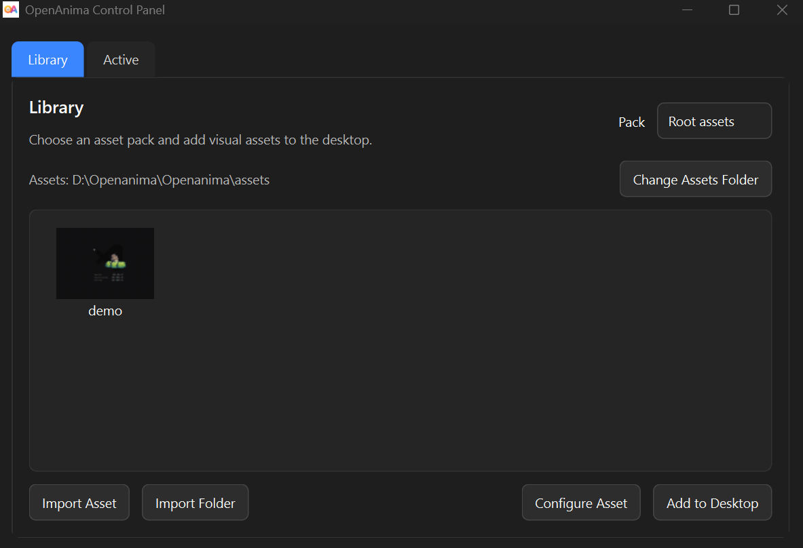
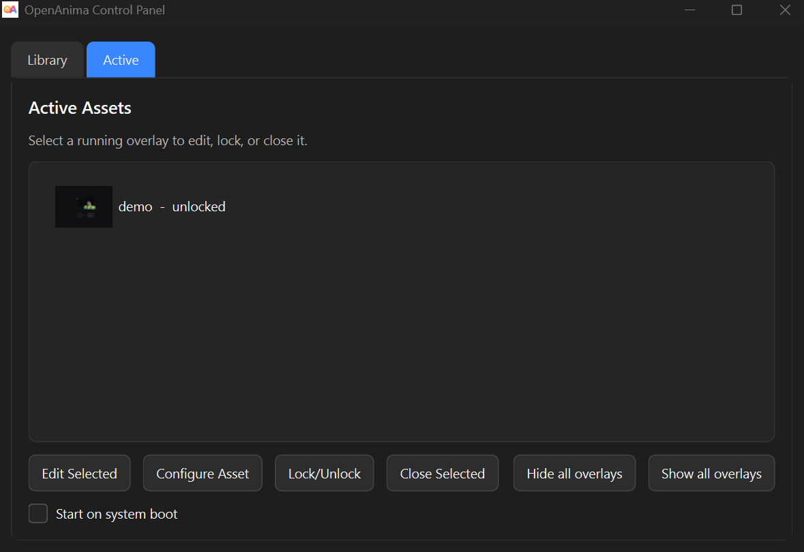
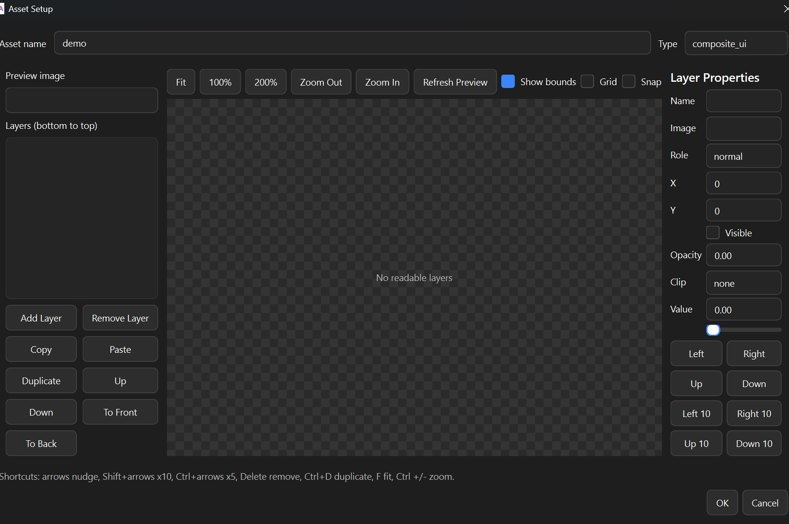

# OpenAnima

<p align="center">
  
</p>

<p align="center">
  <strong>Open-source desktop asset overlay engine for Windows.</strong>
</p>

<p align="center">
  Place GIFs, sprites, frame animations, HUD elements, and game-style assets directly on your desktop.
</p>

<p align="center">
  <a href="https://ertugrulmutlu.github.io/OpenAnima/"><strong>Website</strong></a>
  ·
  <a href="https://github.com/Ertugrulmutlu/OpenAnima/releases/tag/v0.2.0-preview"><strong>Latest Release</strong></a>
  ·
  <a href="https://ertugrulmutlu.itch.io/openanima"><strong>itch.io</strong></a>
  ·
  <a href="https://youtu.be/qgJBF40b_L8"><strong>Demo Video</strong></a>
</p>

---

## Version / Release status

OpenAnima is preparing for `v1.0.0-rc1`. The package version is defined in `openanima_app/version.py` and exposed as `openanima_app.__version__`.

---

## 🎬 Demo

> OpenAnima can turn your desktop into a small animated scene using game-style assets.

<p align="center">
  <a href="https://youtu.be/qgJBF40b_L8" target="_blank">
    
  </a>
</p>

<p align="center">
  <a href="https://youtu.be/qgJBF40b_L8">
    Watch the demo on YouTube
  </a>
</p>

---

## 🌐 Links

* Website: [https://ertugrulmutlu.github.io/OpenAnima/](https://ertugrulmutlu.github.io/OpenAnima/)
* GitHub: [https://github.com/Ertugrulmutlu/OpenAnima](https://github.com/Ertugrulmutlu/OpenAnima)
* Latest release: [https://github.com/Ertugrulmutlu/OpenAnima/releases/tag/v0.2.0-preview](https://github.com/Ertugrulmutlu/OpenAnima/releases/tag/v0.2.0-preview)
* itch.io: [https://ertugrulmutlu.itch.io/openanima](https://ertugrulmutlu.itch.io/openanima)
* Demo video: [https://youtu.be/qgJBF40b_L8](https://youtu.be/qgJBF40b_L8)

---

## 📸 Screenshots

<p align="center">
  
</p>

<p align="center">
  <em>Library tab for browsing imported assets, changing the asset folder, configuring assets, and adding overlays to the desktop.</em>
</p>

<p align="center">
  
</p>

<p align="center">
  <em>Active tab for selecting running overlays, editing them, locking/unlocking them, hiding them, or closing them.</em>
</p>

<p align="center">
  
</p>

<p align="center">
  <em>Asset Setup dialog for configuring metadata-driven assets such as composite UI/HUD overlays.</em>
</p>

---

## 🧠 What is OpenAnima?

**OpenAnima** is an open-source desktop asset overlay engine for Windows.

It started as a lightweight GIF overlay tool, but it is now evolving into a small desktop engine for visual assets.

OpenAnima lets you place animated and static assets directly on your desktop as independent overlay objects.

You can use it for:

* desktop pets
* animated GIF overlays
* pixel-art characters
* sprite animations
* small desktop scenes
* HUD / UI overlays
* game-style visual assets
* experimental desktop customization

Instead of being just a wallpaper, OpenAnima lets you spawn and control desktop objects in real time.

You can:

* spawn multiple overlay assets
* drag them anywhere
* lock them in place
* make them click-through
* keep them always on top
* control scale, opacity, and animation speed
* import and configure different asset formats
* restore your scene on the next launch

All in a lightweight Python-based desktop application.

---

## ✨ Core Features

### 🖱️ Desktop Asset Overlays

OpenAnima lets you place visual assets anywhere on your screen.

Each asset runs as an independent desktop overlay window.

Supported basic controls:

* drag and reposition
* scale
* opacity
* speed for animated assets
* lock / unlock
* click-through mode
* always-on-top mode
* persistent position and settings

---

## 📦 Supported Asset Types

OpenAnima now supports more than GIFs.

### GIF

```txt
something.gif
```

GIF files are played using Qt's animation system.

Supported controls:

* scale
* opacity
* speed
* lock / unlock
* click-through
* always-on-top
* persistent position

---

### Static Images

Supported formats:

```txt
.png
.jpg
.jpeg
.webp
```

Static images are rendered as desktop overlay objects.

Transparent PNGs work well for stickers, icons, characters, and decorative elements.

---

### Frame-Folder Animations

Frame animations can be stored as folders of ordered image files.

Example:

```txt
Idle/
  idle_01.png
  idle_02.png
  idle_03.png
```

Optional metadata:

```json
{
  "type": "frame_animation",
  "name": "Idle",
  "fps": 12
}
```

OpenAnima sorts frames naturally, so files like:

```txt
idle_1.png
idle_2.png
idle_10.png
```

play in the expected order.

---

### Sprite Strips

Sprite strips are single images containing multiple frames in one row or column.

Example:

```txt
Run/
  run.png
  asset.json
```

```json
{
  "name": "Run",
  "type": "sprite_strip",
  "image": "run.png",
  "frames": 8,
  "direction": "horizontal",
  "frame_width": 192,
  "frame_height": 192,
  "fps": 8,
  "loop": true
}
```

OpenAnima crops the strip into individual frames and plays one frame at a time.

Sprite strip setup supports:

* horizontal strips
* vertical strips
* frame count
* FPS
* loop
* explicit frame width
* explicit frame height
* manual crop margins
* anchor metadata
* live frame preview grid
* frame export helper

---

### Spritesheets

Spritesheets can define named animations using metadata.

Example:

```txt
Slime/
  sheet.png
  asset.json
```

```json
{
  "name": "Slime",
  "type": "spritesheet",
  "image": "sheet.png",
  "frame_width": 32,
  "frame_height": 32,
  "default_animation": "idle",
  "animations": {
    "idle": {
      "fps": 8,
      "loop": true,
      "frames": [
        { "col": 0, "row": 0 },
        { "col": 1, "row": 0 },
        { "x": 64, "y": 0 }
      ]
    }
  }
}
```

Supported spritesheet features:

* frame width / height
* named animations
* default animation
* `col` / `row` frame definitions
* direct `x` / `y` frame definitions
* animation-specific FPS
* animation selection in the editor
* per-overlay selected animation persistence

---

### Composite UI / HUD Assets

Composite UI assets are made from multiple image layers.

This is useful for game-style HUD elements like:

* health bars
* mana bars
* stamina bars
* energy bars
* status panels
* layered UI widgets

Example:

```txt
HP Bar/
  Hp bar.png
  red bar.png
  Blue bar.png
  yellow bar.png
  HP bar preview.png
  asset.json
```

```json
{
  "name": "Sci-Fi HP Bar",
  "type": "composite_ui",
  "preview": "HP bar preview.png",
  "layers": [
    {
      "name": "base",
      "image": "Hp bar.png",
      "x": 0,
      "y": 0
    },
    {
      "name": "health",
      "image": "red bar.png",
      "x": 380,
      "y": 324,
      "value": 1.0,
      "clip": "horizontal"
    }
  ]
}
```

Composite UI layers support:

* image
* x / y position
* visibility
* opacity
* horizontal clipping
* vertical clipping
* runtime value

Clipped layers can be controlled live from the editor using runtime sliders.

For example:

* health
* mana
* energy
* stamina

Runtime values are saved per overlay instance without overwriting the original `asset.json`.

---

## 🧰 Control Panel

OpenAnima includes a built-in Control Panel.

### 📚 Library Tab

Use the Library tab to:

* browse available assets
* import files or folders
* run the asset analyzer
* configure metadata-driven assets
* add assets to the desktop

---

### ⚡ Active Tab

Use the Active tab to:

* view running overlays
* select active overlays
* close overlays
* manage currently active desktop assets

---

### 🛠️ Editor Tab

Use the Editor tab to fine-tune selected overlays.

Common controls:

* scale
* opacity
* speed
* lock / unlock
* click-through
* always-on-top
* reload asset

Asset-specific controls:

* spritesheet animation selector
* composite UI runtime sliders
* metadata-based reload support

---

## 🧠 Smart Asset Import

OpenAnima includes an asset analyzer and import wizard.

When importing a file or folder, OpenAnima can detect possible asset types and show confidence-based guesses.

The analyzer can detect:

* GIF
* static image
* frame-folder animation
* horizontal sprite strip
* vertical sprite strip
* spritesheet / grid-based asset
* composite UI / HUD folder
* existing `asset.json`
* preview / sample / example files

The user can choose or correct the final asset type before metadata is created.

This helps avoid importing ambiguous game assets incorrectly.

---

## 🛠️ Asset Setup Dialog

Metadata-driven assets can be configured through the Asset Setup dialog.

Current setup tools include:

### Sprite Strip Setup

* frame count editor
* direction selector
* frame width / height fields
* crop left / top / right / bottom fields
* anchor X / Y fields
* live frame preview grid
* frame export helper
* side-by-side settings and preview layout

### Composite UI Setup

* visual layer editor
* layer selection
* layer movement
* layer reordering
* preview click selection
* drag-to-move layers
* keyboard nudging
* duplicate layer
* delete layer
* copy / paste layer
* undo / redo
* bring forward / send backward
* bring to front / send to back
* drag-and-drop layer reordering
* overlap cycling with Alt/Ctrl click
* bounds / grid display

---

## 💾 Persistent State

OpenAnima saves overlay state automatically.

Saved properties include:

* asset path
* asset type
* position
* scale
* opacity
* speed
* lock state
* click-through state
* always-on-top state
* selected spritesheet animation
* composite UI runtime values

When OpenAnima starts again, active overlays are restored if their asset paths still exist.

Backward compatibility is preserved for older GIF/static/frame-folder workflows.

---

## 🖥️ System Integration

OpenAnima is designed as a lightweight Windows desktop tool.

Features:

* system tray support
* portable executable support
* transparent overlay windows
* always-on-top mode
* click-through mode
* local asset folders
* no internet required for normal usage

Performance note:

> OpenAnima is designed to stay lightweight. In a small 2D overlay scene, it can run around ~50-70 MB RAM depending on the loaded assets.

---

## 🚀 Download

Get the latest Windows build from:

👉 [OpenAnima v0.2 Preview Release](https://github.com/Ertugrulmutlu/OpenAnima/releases/tag/v0.2.0-preview)

You can also download it from itch.io:

👉 [OpenAnima on itch.io](https://ertugrulmutlu.itch.io/openanima)

---

## ▶️ Usage

### Start the app

```bash
OpenAnima.exe
```

### First launch

The app automatically creates:

```txt
assets/
config.json
```

### Add your first asset

1. Open the Control Panel
2. Go to **Library**
3. Click **Import Asset**
4. Select a file or folder
5. Review the analyzer guesses
6. Confirm or configure the asset type
7. Click **Add to Desktop**

---

## 📁 Asset Folder Structure

Simple assets can be placed directly inside `assets/`.

Example:

```txt
assets/
  cat.gif
  sticker.png
```

Metadata-driven assets can use folders.

Example:

```txt
assets/
  Archer_Run/
    Archer_Run.png
    asset.json

  HP_Bar/
    Hp bar.png
    red bar.png
    Blue bar.png
    asset.json
```

---

## ⚠️ Preview Status

This release introduces OpenAnima's metadata-driven asset system.

The following workflows are supported but still considered preview-level:

* sprite strip setup
* spritesheet configuration
* composite UI / HUD layout editing
* metadata reload for running overlays
* complex game asset import workflows

Some assets may require manual setup, especially when frame counts, frame sizes, layer positions, or metadata cannot be detected automatically.

---

## Known Limitations

* Sprite strips may require manual frame count or frame size correction.
* Some sprite strips with unusual padding may need manual crop values.
* Spritesheets require metadata or setup through the import wizard.
* Composite UI assets may require manual layer alignment.
* The Composite UI editor is functional but not a full professional layout tool.
* 3D model support is not included yet.
* Some unusual asset packs may still need manual `asset.json` editing.
* Assets from third-party packs should only be used if their license allows it.

---

## ⚙️ Build from Source

```bash
pip install -r requirements.txt
python main.py
```

---

## 📦 Build EXE

```bash
pyinstaller --noconfirm --onefile --windowed --name OpenAnima --icon=icon.ico --add-data "icon.ico;." main.py
```

Output:

```txt
dist/OpenAnima.exe
```

---

## 🧠 Tech Stack

* Python
* PySide6 / Qt
* PyInstaller
* JSON-based asset metadata
* Local asset folders

---

## 💡 Why OpenAnima?

Most desktop customization tools are:

* closed-source
* heavy
* hard to extend
* limited to fixed workflows

OpenAnima is:

* open-source
* lightweight
* hackable
* developer-friendly
* asset-based
* metadata-driven
* built around local files and simple folders

OpenAnima is not just a GIF player.

It is evolving into a small desktop asset overlay engine for interactive visual assets.

---

## 🔮 Future Ideas

Possible future improvements:

* 3D model support with `.glb` / `.gltf`
* static `.obj` model support
* better sprite crop / anchor tools
* improved composite UI editor
* asset pack export/import
* plugin system
* advanced animation behaviors
* scene mode
* isometric/depth-aware overlay mode
* sound-reactive assets
* cross-platform support

---

## 🤝 Contributing

Contributions are welcome.

You can help by:

* opening issues
* reporting bugs
* testing asset packs
* improving import detection
* improving UI/UX
* adding renderer support
* submitting pull requests

---

## ⭐ Support

If you like OpenAnima, give it a star ⭐

It helps the project reach more people.

---

## 📜 License

MIT License

---

Built with ❤️ by Ertuğrul Mutlu
